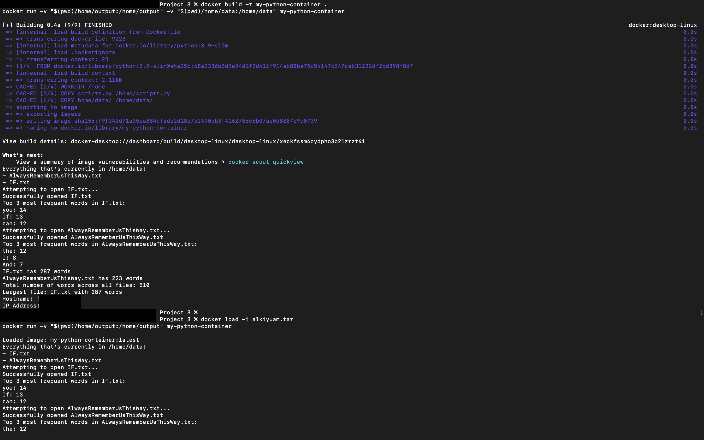

# Project 3: Docker Container for Data Processing Script

**Due Date**: Sunday, 11:59 PM  
**Total Points**: 10 (plus 2 Extra Credit)

## Project Overview
This project involves building and deploying a Docker container that automates text file processing through a Python script. The container will count words, handle contractions, find frequent words, and display results along with the machine’s IP address. Screenshots of Docker Desktop and a tar file of the final container image are required for submission.

## Requirements

### Part 1: Docker Installation
1. Install Docker Desktop on your personal computer (Windows, macOS, or Linux).
2. Submit a screenshot of Docker Desktop showing your containers running.

### Part 2: Dockerfile Setup
1. Create a `Dockerfile` using a lightweight base image (e.g., `ubuntu`, `alpine`, or `python:3.9-slim`).
2. Submit the `Dockerfile` as a text file or share it on GitHub.

### Part 3: Script Development
1. Write a Python script (`scripts.py`) to read and process two text files, `IF.txt` and `AlwaysRememberUsThisWay.txt`, from `/home/data` inside the container.
2. Submit the script as a text file or on GitHub.

### Part 4: Script Objectives
The Python script should accomplish the following:

- **Word Count in Each File**: Count the total number of words in each file.
- **Grand Total Word Count**: Sum the word counts from both files.
- **Top 3 Frequent Words in IF.txt**: Find and display the three most frequent words in `IF.txt` with counts.
- **Top 3 Frequent Words in AlwaysRememberUsThisWay.txt**: Handle contractions (e.g., "I'm") by splitting, then display the three most frequent words with counts.
- **IP Address Retrieval**: Display the IP address of the machine running the container.
- **Output Results**: Write all results to `/home/data/output/result.txt` and print the contents to the console upon container execution.

### Part 5: Optimize Docker Image
- Minimize the Docker image size (target size: less than 200MB).

### Part 6: Submit Final Image
1. Create a tar file of your final Docker image, named with your email username (e.g., `yourusername.tar`).
2. Submit the tar file for evaluation.

---

## Extra Credit
- **Container Orchestration with Kubernetes or Docker Swarm**:
  - Deploy and manage at least two replicas of your container using Kubernetes or Docker Swarm.
  - Submit your Kubernetes manifest (YAML file) or Docker Swarm configuration.
  - Provide the output of `kubectl get pods > kube_output.txt; cat kube_output.txt` or an equivalent command for Docker Swarm.
  
## Key Points to Remember
- Use a lightweight base image in the Dockerfile to minimize the final image size.
- Ensure the script can handle contractions and edge cases.
- The container should be fully automated, executing, generating output, and exiting without manual interaction.
- Test the container to ensure it runs correctly on any machine.
- Confirm that all outputs (word counts, IP address, etc.) are written to `result.txt` and printed to the console when the container runs.

---

## Application Setup Screenshots

Below are the key screenshots documenting each step of the application setup on AWS EC2.

